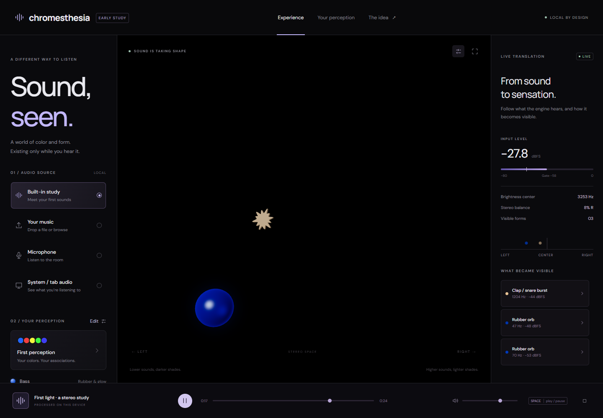
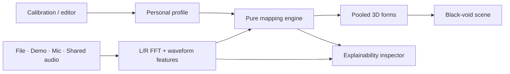

<div align="center">

# Chromesthesia

### Sound, seen.

**A real-time synesthetic engine that turns audio into a personal world of color, shape, and motion.**

React · TypeScript · React Three Fiber · Web Audio

**Early MVP · Local by design**

[](https://github.com/Shmartin1/chromesthesia/actions/workflows/ci.yml)

[Issues](https://github.com/Shmartin1/chromesthesia/issues) · [Milestones](https://github.com/Shmartin1/chromesthesia/milestones)

</div>

In silence, nothing. A bass pluck becomes a glowing blue rubber orb. A sustained note stretches into a tube. Voice-like textures diffuse into pastel wisps; bright tones become neon; dense chords flicker like multicolored flame. Drum attacks become solid forms: round black kicks, warm irregular clap/snare bursts, and small silver hat/shaker flickers. When the sound disappears, the world disappears with it.

Chromesthesia starts from one person's synesthetic associations and makes them editable. It is a coherent abstract listening space, with stereo placement, pitch-driven height and brightness, and quiet sounds that recede into black.



The scene uses elastic attack response, translucent dye plumes, luminous filaments, and stable tracking across frequency regions. Melodic forms branch into irregular currents, unfolding billows and fine curling tendrils inspired by food coloring in water. Each new sound receives a different, stable shape; continuous motion preserves its stereo anchor, note color and momentum. These are lightweight procedural surfaces, not a physical fluid simulation. Every form still disappears immediately in silence.

> **An interpretation, not instrument separation.** The MVP measures stereo energy, frequency and texture, then applies transparent heuristics. Overlapping sounds in a finished mix cannot be reliably identified or positioned independently. The inspector explains the interpretation, and your profile can override it.

## Listen locally

Use **Node 24** (minimum 22.12) and npm. From this repository:

```sh
git clone https://github.com/Shmartin1/chromesthesia.git
cd chromesthesia
npm ci
npm run dev
```

Open [localhost:5173](http://localhost:5173), click **Begin the study**, and use headphones to explore stereo placement. The original 24-second study deliberately ends in silence. No API key, account, backend or downloaded model is required.

| Input              | How it works                                                                |
| ------------------ | --------------------------------------------------------------------------- |
| Built-in study     | Original procedural stereo music; no external recording                     |
| Your music         | Select or drop an audio file; browser-supported formats such as MP3/WAV/OGG |
| Microphone         | Explicit browser permission; adjust the silence threshold for room noise    |
| System / tab audio | Choose a source in the browser picker and enable audio sharing              |

Microphone and shared audio are analyzed **without speaker monitoring**, avoiding feedback. Tab/system capture depends on browser, operating system and the selected source; an audio track is required. The app cannot capture protected audio or guarantee universal system loopback. See [the browser API limitations](https://developer.mozilla.org/en-US/docs/Web/API/MediaDevices/getDisplayMedia). HTTPS or localhost is required for live inputs.

No audio is uploaded, and profiles stay on your device unless you export them. Assets and fonts are served locally. This release does not yet include an installable offline PWA.

## Make it yours

Open **Your perception** to choose colors, motion, glow, stereo width, pitch height, depth, sensitivity and a silence threshold. Five short calibration studies help you explore associations; the voice study is synthesized, not recorded singing. Preview shapes never replace your saved overrides.

- **Low:** below 220 Hz; defaults to blue bass forms.
- **Mid:** 220–2,600 Hz; texture-based voice/synth/flame interpretations.
- **High:** above 2,600 Hz; brighter, higher forms.

Melodic plumes, neon and flames share a full twelve-note rainbow: C red, C♯ orange, D yellow, E green, F♯ cyan, G♯ blue, A violet, and the intervening hues for the other notes. The same pitch class repeats its hue across octaves; frequency controls its darker or lighter shade. Unresolved plumes use the nearest note-color at their spectral frequency, explicitly labeled as a color approximation rather than a detected note. Bass retains its personal blue range, and drums retain their own palettes.

Stereo analysis retains multiple resolved notes per region and measures L/R energy around each peak. Up to 24 tonal forms share the view, with capacity for quieter side detail. The inspector’s stereo strip shows their distribution even when the overall mix is balanced. Its mapping list reserves five cards’ worth of space through silence and busy passages; expanded explanations scroll inside that fixed area. Hats occupy the upper register.

The fifth calibration study adds a 120 BPM rhythm with sixteenth-note hats. Polygons respond to measured transients, without a generated visual beat grid. Black kicks use subtle charcoal reflections so they remain legible against the void.

Region overrides make the interpretation explicit and suppress automatic percussion in that region. Import/export portable JSON or try [First perception](examples/profiles/first-perception.json) and [Quiet perception](examples/profiles/quiet-perception.json). Profile data is versioned and validated. Read the [profile design](docs/PROFILES.md).

**Space** plays/pauses (or stops live input). **F** enters immersion. **Escape** returns to controls. The canvas is pure black in silence; normal-mode labels and controls are outside the world. Reduced motion removes drift and wobble, while sound-driven appearance still works.

## How it works



The engine keeps measurement, interpretation, rendering and profile storage separate. Geometry and materials are reused; curves deform on the GPU and temporal animation runs outside React state. Stable spectral matching and velocity-continuous springs reduce flicker and snapping without holding inaudible sounds. The inspector updates at 10 Hz and shows the same events the renderer receives, including raw features and the reason for each form.

| Package             | Responsibility                                                 |
| ------------------- | -------------------------------------------------------------- |
| `apps/web`          | Listening interface, transport, inspector and calibration      |
| `packages/audio`    | Inputs, stream ownership, procedural audio and stereo analysis |
| `packages/core`     | Shared contracts and deterministic mapping rules               |
| `packages/profiles` | Defaults, validation and persistence                           |
| `packages/scene`    | R3F forms, materials and procedural shaders                    |

Read the [PRD](docs/PRD.md), [architecture and exact stack](docs/ARCHITECTURE.md), and [ordered issues](docs/ISSUES.md).

## Develop and verify

```sh
npm run dev            # Development server
npm run test           # Mapping, analysis, profile and capture lifecycle tests
npm run typecheck      # Strict TypeScript
npm run lint           # ESLint
npm run format         # Prettier
npm run check          # Lint + unit tests + typecheck/build + format check
npx playwright install chromium
npm run test:e2e        # Real browser audio, transport, profile and layout tests
npm run screenshots    # Reproduce README screenshots with the original study
npm run build          # Static output in apps/web/dist
npm run preview        # Serve production build locally
```

GitHub Actions runs the quality gate and Chromium tests. See [validation and manual checks](docs/VALIDATION.md) for what has and has not been verified. Serve the contents of `apps/web/dist` over HTTPS for deployment; no server routes or environment secrets are needed. A host may still need to allow microphone/display capture in its permissions policy.

## Roadmap

- [x] Black void, sculptural tonal forms, solid percussion, stereo placement and immediate gating
- [x] Spectral note colors, transient-driven drum articulation and low bass placement
- [x] Local files, original study, microphone and tab/system input adapters
- [x] Personal profiles, synthetic calibration, import/export and reduced motion
- [x] Measured-feature inspector, tests, CI and modular workspace
- [ ] Owner-led listening trials and refinement against isolated reference sounds
- [ ] Real-device capture matrix, measured latency and integrated-GPU benchmarks
- [ ] Synchronized stems and per-stem mappings
- [ ] Better temporal/harmonic tracking and adaptive quality, justified by measurements
- [ ] Optional offline install, recording, MIDI and preprocessing experiments

**Performance target:** smooth 60 FPS on a typical laptop with capped DPR. The 2048-sample analysis window is about 43 ms at 48 kHz; device and scheduling delay add to this. Timing values in the inspector are estimates, not measured end-to-end latency. Exact note transcription, perfect timbre labels and universal system capture are outside this MVP.

## Demo and media

The playable demo is bundled in the app. [Interface screenshot](docs/media/experience.png) · [Live scene](docs/media/live-world.png).

Isolated rendering studies use original synthetic audio and explicit profile overrides to make each material easy to review: [rubber orb](docs/media/bass-orb.png), [sustained tube](docs/media/bass-tube.png), [voice dye plumes](docs/media/voice.png), [synth filaments](docs/media/synth.png), and [flame billows](docs/media/flame.png). A [controlled percussion rendering study](docs/media/percussion.png) shows the three percussion materials using fixed mapping events. A [twelve-note plume study](docs/media/rainbow-notes.png) shows the full chromatic rainbow. A [stereo note-color study](docs/media/stereo-notes.png) shows separate note hues and a high-positioned hat. These images are material demonstrations, not classifier benchmarks.

**Public demo:** deployment URL pending. **Demo video:** reserved for a 20–30 second capture showing bass → wisps/neon → dense chord → silence, followed by one profile edit. Use the original study or appropriately licensed audio.

## Contribute

Read [CONTRIBUTING.md](CONTRIBUTING.md). Small improvements grounded in a concrete listening example are welcome. Preserve black-on-silence, local processing, input cleanup and understandable mapping rules.

Original project code and procedural study audio: [MIT license](LICENSE). The interface incorporates adapted [React Bits](https://reactbits.dev/) Blur Text and Spotlight Card components, which retain their **MIT + Commons Clause** license. See [third-party notices](THIRD_PARTY_NOTICES.md) for the exact scope and attribution; bundled dependencies and fonts retain their respective licenses.
