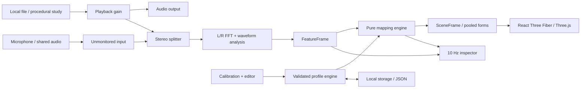

# Architecture

## Pipeline



Profiles configure mapping; they are not a slow processing stage after rendering. The four engine boundaries share typed value objects. The audio engine owns mutable browser resources, core owns deterministic interpretation, scene owns GPU resources, and profiles owns validation/persistence.

## Repository

```text
apps/web/                 React application, transport, controls, inspector, calibration
packages/audio/           Input lifecycle, original study synthesis, stereo analysis
packages/core/            Feature/profile/scene contracts and pure mapping
packages/profiles/        Validated defaults, storage and portable profiles
packages/scene/           R3F scene, pooled geometry, materials and procedural shaders
examples/profiles/        Importable profiles
docs/                    PRD, architecture, profile design, validation, ordered backlog
tests/                   Browser integration tests
.github/                 CI and issue templates
```

Dependencies point inward to `core`. `core` has no browser or graphics imports. Tests may consume profile fixtures. Packages expose TypeScript directly to Vite; this is a private workspace, not an already-published SDK. Independent package builds, task orchestration frameworks, event buses and dependency injection containers would add little value at this size.

## Exact toolchain

| Layer          | Choice                                                      | Why                                                                  |
| -------------- | ----------------------------------------------------------- | -------------------------------------------------------------------- |
| UI             | React / React DOM 19.3.0                                    | Accessible declarative controls                                      |
| UI animation   | Motion 14.0.0; pinned React Bits Blur Text / Spotlight Card | Interruptible transitions, restrained reveals and hover lighting     |
| Language       | TypeScript 5.9.3, strict + unchecked-index checks           | Supported by the chosen lint stack; no forced peer-dependency bypass |
| Rendering      | React Three Fiber 9.8.1; Three.js 0.186.1                   | React 19-compatible stable R3F line; familiar WebGL deployment       |
| Audio          | Browser Web Audio API                                       | Local, direct signal access and playback; no heavyweight DSP runtime |
| Build          | Vite 8.3.2; React plugin 6.1.1                              | Fast dev loop, static output                                         |
| Unit tests     | Vitest 5.0.3                                                | Fast tests for pure contracts and lifecycle doubles                  |
| Browser tests  | Playwright 1.63.0                                           | Real Web Audio, transport, profile and responsive tests              |
| Lint / format  | ESLint 10.12.0, typescript-eslint 8.71.0, Prettier 3.9.9    | Shared workspace checks                                              |
| Typography     | Locally served Fontsource variable DM Sans / Manrope 5.3.0  | No external font-service requests                                    |
| Workspace / CI | npm workspaces and lockfile; GitHub Actions on Node 24      | Small, reproducible toolchain                                        |

React/R3F compatibility is documented in [R3F installation](https://r3f.docs.pmnd.rs/getting-started/installation). Runtime package declarations and `package-lock.json` are authoritative for installed versions.

## Audio engine

- Files use `HTMLAudioElement` and an object URL, avoiding whole-song decoded PCM allocation.
- Demo/calibration studies use generated stereo `AudioBuffer`s with deterministic envelopes and pans. No copyrighted recordings are bundled. The voice study is synthesized and is not a real voice classifier benchmark.
- Microphone uses `getUserMedia`; constraints request two channels and disable echo cancellation, AGC and noise suppression. Devices/browsers may still provide mono or processing.
- Tab/system audio uses `getDisplayMedia({video: true, audio: true})`. An audio track is required. The mandated video track is retained for the capture session but never rendered, encoded, or uploaded; all tracks stop together.
- Capture is never connected to audible output, preventing feedback or double playback. A zero-gain sink keeps analyzer graph branches active. File/demo analysis is after playback volume, so mute is also visually silent.
- A generation token invalidates late permission/playback results. Switching/stop/dispose disconnect nodes, stops tracks, revokes object URLs and clears feature state.
- Capture capability is browser/OS/source dependent. See [MDN getDisplayMedia](https://developer.mozilla.org/en-US/docs/Web/API/MediaDevices/getDisplayMedia). The app reports missing tracks instead of implying universal loopback support.

## Analysis contract

Two independent `AnalyserNode`s use FFT size 2048 and smoothing 0. At 48 kHz this is a 42.7 ms window and 23.4 Hz bin spacing. Resolved local peaks receive a parabolic interpolation in log magnitude and an equal-tempered note estimate at A4 = 440 Hz. This improves bin-center accuracy, but spectral partials are not separated fundamental notes; dense chords and unresolved sub-bass remain approximate. Noise/flatness and local-peak checks suppress unsupported note labels. Unsummed left/right waveforms produce RMS, peak and stereo balance, avoiding antiphase cancellation. Fifteen logarithmic regions summarize peak spectral amplitude, weighted frequency, flatness, onset and active duration.

`FeatureFrame` carries timestamps, global RMS/peak/centroid/stereo, per-band features with optional pitch estimates, and active percussion attacks. Full-input gating happens before interpretation. A threshold also suppresses low-level spectral bands; nearby peaks with similar positions are consolidated to reduce duplicate shapes. This can merge close sources and is deliberately documented as an approximation.

## Mapping engine

`mapFeatures(frame, profile)` returns a `SceneFrame` without IO, random state, wall-clock access or Three.js types. It assigns families by simple frequency/texture/duration rules, then maps stereo to X, log frequency to height/lightness (bass occupies a lower register near the bottom), and band intensity to size/depth/opacity. Low events distinguish a short attack from a sustain. Region overrides are explicit provenance, not detection claims; they also suppress automatic percussion in the overridden region.

`TransientDetector` measures positive spectral flux and rising energy across low, mid and high ranges, with an adaptive background, texture/occupied-spectrum checks, and a 45 ms retrigger interval. Kick candidates additionally need a downward low-frequency sweep and low-band dominance. Snare/clap and hat/shaker are grouped interpretations. A broadband snare is not deliberately doubled as a hat; overlapping sources can still be misclassified. Stereo positions come from each range’s independent L/R energy. Duplicate audio timestamps reuse the same hit IDs instead of retriggering. No BPM estimate or generated metronome drives the visuals.

The transient envelope follows current spectral energy with short articulation caps (75 ms hats, 200 ms snares, 240 ms kicks) and disappears immediately below the band/global gate. These caps keep fast hits discrete; long cymbal tails are not isolated as separate instruments. The approach follows the positive-change principle used by [spectral-flux onset methods](https://aubio.org/doc/0.4.0/specdesc_8h.html). Native FFT window behavior is specified by the [Web Audio standard](https://www.w3.org/TR/webaudio/#fft-windowing-and-smoothing-over-time).

`noteColor` is a pure, deterministic pitch-class lookup derived from existing profile colors: twelve shades of the bass anchor, and twelve interpolated voice/synth colors. Octave remains a separate lightness input. Unresolved/noisy bands use the family base color. Percussion has its own palette and is never assigned an arbitrary pitched-note color.

An event includes the form, palette color, lightness, position, scale, motion/glow, feature values, reason, and heuristic score. These exact events feed the inspector. Silence returns an empty event list, with no smoothing or lingering release system. FFT/window/device latency remains; “instant” means no extra intentional tail.

## Scene engine

A fixed perspective camera looks into black. Fifteen reusable slots share GPU-evaluated parametric geometry. The five tonal treatments are elastic blue orbs, rounded bending bass tubes, nine-layer translucent voice ribbons, five-strand luminous synth curves, and fifteen-fold multicolor flame curtains. Surface normals, highlights, edge fibers and soft local glow give the forms depth without a landscape, global bloom, ambient particles or feedback buffer. Vertex curves animate through uniforms, with no per-frame geometry rebuilds or buffer uploads. Shader programs warm up before first use.

Three additional percussion meshes use round beveled kick discs, irregular twelve-lobed clap/snare bursts, and small faceted hat octahedra. Kick surfaces are black with neutral charcoal reflections; snare/clap surfaces range beige to orange and hat/shaker surfaces gray to white with spectral brightness. These meshes bypass tonal springs and crossfades so rapid attacks remain distinct. Low-positioned forms have a viewport safety margin. No drum emits a glow or persists into silence.

`SoundTracker` matches current detections to existing slots using frequency proximity and stereo position, preserving a surface across neighboring FFT bands and intensity reorderings. It is presentation continuity, not source separation. Every slot must still correspond to a current event. Missing events clear immediately; a new generation resets all animation history, including after silence.

`SoundTransition` preserves velocity with analytic critically damped springs for position (X/Y/Z rates 36/28/24 per second), size (32/s), brightness/glow (28/s), motion (24/s), linear color (40/s), and shape weights (28/s). Active intensity retains a fast 18 ms attack / 85 ms release response. A new tonal form is visible on its first frame at 25% presence, reaching 96% within 60 ms; disappearance still happens immediately when its event is absent. Timbre changes must persist for 90 ms before a continuous shape blend. Bass viewport margins follow these blended weights, avoiding a vertical snap during family changes.

Onsets add velocity to an analytic damped oscillator, preserving deformation position even during rapid retriggers. Geometric ripples use a continuously advancing phase, so a new attack does not reset the wave. Three overlapping light accents travel independently and enter from zero strength; a new note does not teleport an existing accent. Procedural phase advances by at most 50 ms after a stalled frame, while envelopes age by the actual elapsed time. Reduced motion clears elastic/pulse motion and bypasses presentation settling. These responses only exist while an audible event owns its slot; there is no release tail into silence.

Additive translucent surfaces use Three.js `forceSinglePass`: their color accumulation does not require separate front/back transparency sorting. This removes the second draw call and duplicate vertex processing for each ribbon/aura mesh. Hidden material uniforms are no longer updated. This reduces rendering work without changing geometry detail or adding resolution changes.

Horizontal anchors compress into the camera width on narrow viewports, and large silhouettes scale down to fit. Depth remains perspective depth. Reduced motion bypasses interpolation and freezes procedural travel/deformation while retaining sound-driven appearance and disappearance. The raw mapping output and inspector remain deterministic and unfiltered; presentation tracking and settling are confined to `packages/scene`.

The scene implementation separates `tracking.ts` (surface identity), `transition.ts` (temporal response), `geometry.ts` (shared parametric meshes), `materials.ts` (GPU surfaces), `percussion.tsx` (solid transient materials/articulation), and `index.tsx` (R3F lifecycle and uniform updates). `VisualEvent` now carries onset and age from the audio feature frame for musical articulation.

Motion handles interface entrances/exits, source selection and navigation; CSS interpolates inspector column width. Native modal focus trapping is retained through the profile exit animation, then focus returns to its opener. New profiles inherit the operating system's reduced-motion setting; the profile checkbox provides a persistent explicit override. Reduced motion also bypasses scene interpolation. Vendored React Bits components and their separate license are recorded in [third-party notices](../THIRD_PARTY_NOTICES.md).

Frame data lives in a ref; meshes update in `useFrame`. React UI telemetry updates at 10 Hz. The inspector's UI FPS is a request-animation-frame rate, not GPU frame timing or a hardware certification. R3F recommends avoiding state updates inside the render loop: [performance pitfalls](https://r3f.docs.pmnd.rs/advanced/pitfalls).

## Tradeoffs and later evolution

**Native analyzers now, AudioWorklet later:** low setup cost and direct playback integration; main-thread scheduling and bass frequency resolution are imperfect. Add a worklet/worker only after profiling or better feature requirements justify it.

**Heuristics now, source separation later:** immediate startup and no model download versus uncertain timbre labels and merged stereo sources. Stem input is the most transparent next step. Local ML preprocessing trades wait time and memory for stronger separation; a remote model changes privacy and operating cost.

**Small custom profile validator:** bounded, copy-only schema with explicit errors; no generic rules DSL or executable expressions. A schema library becomes worthwhile as migrations and rule complexity grow.

**WebGL / simple local glow:** mature R3F API and modest GPU cost; stylized smoke/flames rather than expensive fluid simulation. WebGPU, volumetric simulation, recording and adaptive quality remain future work.

**Static local-first app:** no sign-in, backend or storage service. Profiles are device-local until exported. Initial asset caching is normal browser caching; this MVP does not guarantee offline reload or installability.
